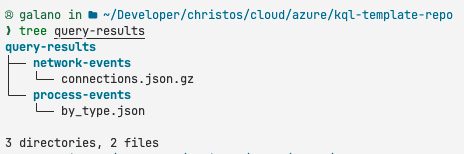

# Usage Guide

This guide explains how to use the KQL Template Repository for executing KQL queries and handling their outputs.

## Table of Contents

- [Execution with GitHub Actions](#execution-with-github-actions)
- [Execution with Python Script](#execution-with-python-script)
- [Understanding Output Configuration](#understanding-output-configuration)
- [Common Usage Scenarios](#common-usage-scenarios)

> [!TIP]
> Make sure you have read the dedicated guidelines:
>
> - [Azure Guide](/docs/azure.md)
> - [GitHub Guide](/docs/github.md)
> - [Configuration Guide](/docs/configuration.md)

---

## Execution with GitHub Actions

When using GitHub Actions, the workflow will automatically execute all KQL queries in the specified folder.

> [!IMPORTANT]
> When using GitHub Actions, keep output file paths within `query-results/` directory to ensure they are properly uploaded as workflow artifacts.

### Recommended `.kql-config.yaml` for GitHub Actions

```yaml
version: '1.0'

queries:
  - file: 'process-events.kql'
    output:
      - format: jsonc  # Display in console with colors

      - format: json   # Store filtered results
        query: '[].{Time: TimeGenerated, Source: Source}'
        file: 'query-results/process-events/complete.json' # Folders are created automatically if they do not exist

      - format: json   # Store full results
        file: 'query-results/process-events/filtered.json' # Folders are created automatically if they do not exist
        compression: gzip
```

📌 **Why this setup?**

- Ensures results are displayed in the workflow logs
- Stores complete results as artifacts
- Allows filtered results with specific fields
- Uses compression for larger result sets
- Follows the repository's path structure for artifact uploads

---

## Execution with Python Script

To run queries locally using the Python script, follow these steps:

### 1. Set Up a Virtual Environment

```sh
python3 -m venv venv
source venv/bin/activate  # On Windows use: venv\Scripts\activate
pip install -r .github/scripts/kql_query_executor/requirements.txt
```

### 2. Login to Azure

```sh
az login
```

### 3. Run the Query Execution Script

```sh
# Make sure you are in the repository root
python .github/scripts/kql_query_executor/main.py \
  -w <workspace-id> \
  -f library/<query-folder> \
  -s kql-config-schema.json
```

📌 **Command-line Options:**

- `-w, --workspace-id` (required): Azure Log Analytics workspace ID
- `-f, --folder` (required): Folder containing KQL queries
- `-c, --config`: Path to specific config file (optional, default: auto-detect)
- `-s, --schema`: Path to schema file (optional, default: repo root)
- `-l, --log-level`: Logging level (DEBUG, INFO, WARNING, ERROR, CRITICAL)

### 4. View Results

Results will be saved according to your configuration:

```sh
# List all results
ls -la query-results/

# View a specific result file
cat query-results/security-events/high-severity.json
```


<p align="center">
  
</p>

---

## Understanding Output Configuration

The repository supports various output formats and options:

### Output Formats

- `json`: Standard JSON output
- `jsonc`: Colorized JSON (useful for console viewing)
- `table`: Formatted ASCII table
- `tsv`: Tab-separated values
- `yaml`: YAML format
- `yamlc`: Colorized YAML
- `none`: Skip output (useful for testing or boolean results with `echo $?`)

### Output Destinations

- **Console output**: When no `file` is specified
- **File output**: When `file` is specified (directories are created automatically, must *not* contain whitespace)

### Output Transformations

- **JMESPath queries**: Filter and transform results using `query` parameter
- **Compression**: Apply `gzip` or `zip` compression to output files

> ![!IMPORTANT]
> If `queries` is specified in the configuration file, only the queries listed will be executed.

---

## Common Usage Scenarios

### 1. Basic Console Output

```yaml
version: '1.0'

queries:
  - file: 'device.kql'
    output:
      - format: jsonc
```

This displays the query results in the console with syntax highlighting.

### 2. File Output with Filtering

```yaml
version: '1.0'

queries:
  - file: 'security-events.kql'
    output:
      - format: json
        file: 'results/critical-events.json'
        query: 'Events[?Severity == `Critical`]'
```

This saves only the critical events to a JSON file.

### 3. Multiple Output Formats

```yaml
version: '1.0'

queries:
  - file: 'network/traffic.kql'
    output:
      - format: table  # Human-readable table in console

      - format: json   # Complete data in JSON
        file: 'results/traffic/complete.json'

      - format: tsv    # Data for Excel import
        file: 'results/traffic/for-excel.tsv'
```

This configuration displays the table in the console and saves the complete data in JSON and TSV formats.

### 4. Compression for Large Results

```yaml
version: '1.0'

queries:
  - file: 'large-data.kql'
    output:
      - format: json
        file: 'results/large-data.json'
        compression: gzip
```

This compresses the output file to save space, creating `results/audit-logs.json.gz`.
